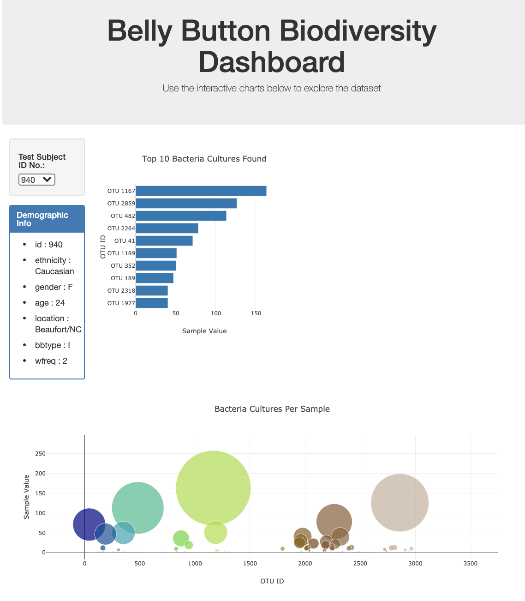

# Belly Button Biodiversity

## Project Overview

The goal of this project was to use JavaScript and Plotly to create an interactive dashboard to explore the [Belly Button Biodiversity dataset](data/samples.json), which catalogs the microbes that colonize human navels.

## Technologies Used

- JavaScript
- HTML
- CSS
- Bootstrap
- D3.js
- Plotly.js

## Plotly Charts

### Horizontal Bar Chart

A horizontal bar chart with a dropdown menu to display the top 10 OTUs found in each individual.

Features:

- Used sample_values as the values for the bar chart.

- Used otu_ids as the labels for the bar chart.

- Used otu_labels as the hovertext for the chart.

### Bubble Chart

A bubble chart that displays each sample.

